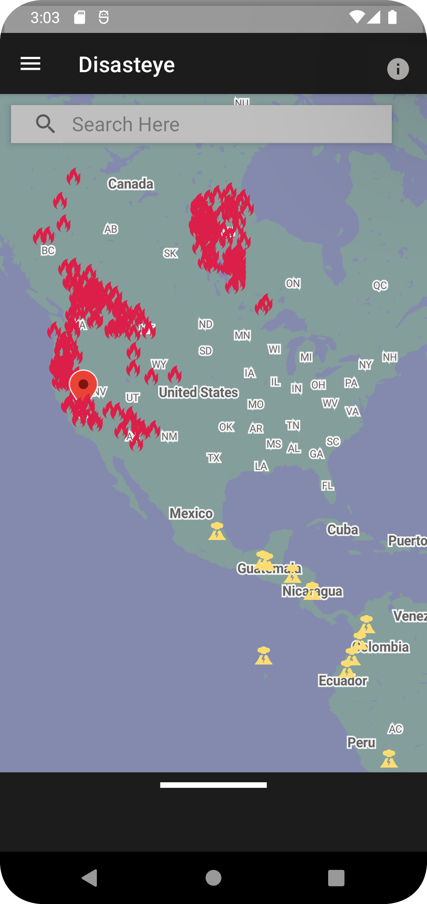
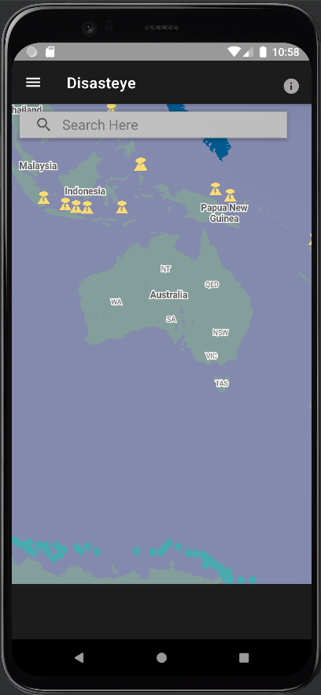
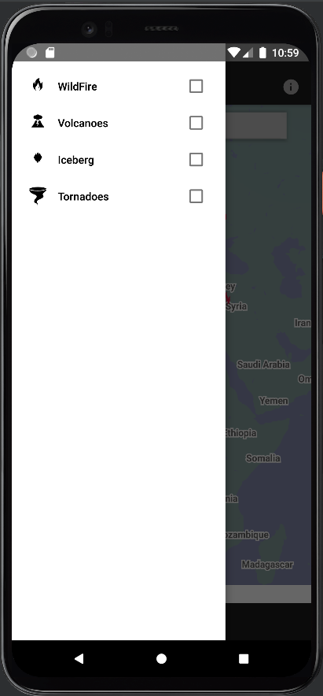

## What is Disasteye?
"Disasteye" is a Natural Disaster Event Tracker android app that provides an aestethic way to visualize natural disasters around the world in real time. Disasteye utilizes both NASA's Earth Observatory Natural Event Tracker (EONET) API and Google Maps for a majority of it's functionality. 

## Features
- [x] 🔍&nbsp;&nbsp;&nbsp;Search Bar
- [x] 🗺&nbsp;&nbsp;&nbsp;Realtime Map updates
- [x] &nbsp;🚩&nbsp;&nbsp;Filter by different disaster types
- [ ] &nbsp;💲&nbsp;&nbsp;&nbsp;&nbsp;Donate link
- [ ] 🌐&nbsp;&nbsp;&nbsp;News about disaster
- [ ] 🕵️‍♂️&nbsp;&nbsp;&nbsp;Details about current disaster
- [ ] ⚙&nbsp;&nbsp;&nbsp;Settings Page

## Screenshots

